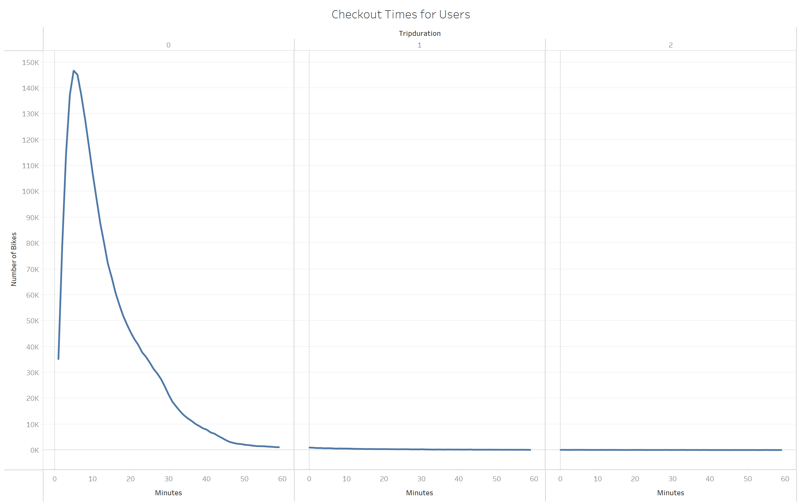

# Bike Sharing

## Overview
The purpose of this analysis is to convince investors that a bike-sharing program in Desmoines is a solid business proposal.

## Results
There are 1.9 million subscribers and 443k customers of Citi Bike in NYC.

Below is the average peak hours on any given day in August.

Most users checkout bikes within an hour in August.

The checkout duration are similar by gender in August.

The peak hours in August are Thursdays 5-7 pm.

The peak hours are similar for female and male bikers.

Most female and male Citi Bike users on any given day are subscribers.

## Summary
To summarize, more than 75% of 2.3 million bikers of the bike-sharing program are subscribers, therefore, there's a huge market potential. With most checkout times being less than an hour, the amount of bikes needed for the program can be determined to satisfy demand.The demand for bike-sharing is the highest on Thursdays. On average, the peak hours were 8-10am and 4-8pm on any given day in August, where bike repairs can be done between 12am and 5am.

### Recommendation
Below are two visual recommendation to further understand customers and their activities.

The peak days in a week are both from Thursday to Saturday for female and male bikers.

.PNG)

Most subscribers of the bike-sharing program are male.

.PNG)